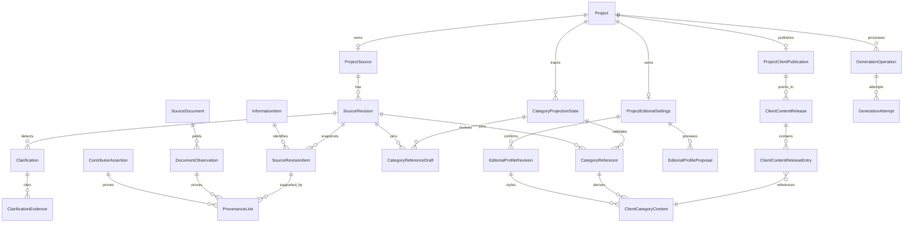

# Data Model: Canonical Document Workflow

**Feature**: `016-canonical-document-workflow`  
**Date**: 2026-08-11  
**Storage**: PostgreSQL  
**Notation**: conceptual Prisma model; exact Prisma syntax and SQL constraints belong to implementation tasks.

## Design invariants

1. A project has at most one `ProjectSource`, one current source revision, one confirmed editorial profile, and one currently published client release.
2. A `SourceRevision` is immutable and contains a complete snapshot of the project’s canonical items. Historical reads never depend on replaying provider calls.
3. Every current `SourceRevisionItem` has at least one supporting `ProvenanceLink` to an immutable document observation or contributor assertion.
4. Documents are inputs and remain contributor-only. Categories are factual projections of the source; client content is an editorial projection of accepted category references.
5. Provider outputs never update published/domain state unless their operation, attempt, source/profile inputs, schema, and business validation are all still current.
6. The client reads one immutable `ClientContentRelease`; a project-wide editorial change is one pointer swap, never four category upserts.
7. Domain errors and provider diagnostics are state, not content. No failure message can be accepted as a factual draft.

## Relationship overview



## Enumerations

Names are indicative and should be mirrored by Zod schemas when they cross the API boundary.

### Documentary source

- `SourceDocumentKind`: `upload`, `notion`
- `SourceDocumentStatus`: `received`, `extracting`, `ready_to_consolidate`, `incorporating`, `incorporated`, `retrying`, `failed`, `removal_pending`, `removal_failed`, `removed`
- `SourceRevisionTrigger`: `document_added`, `document_removed`, `clarification_answered`, `guided_correction`, `working_language_changed`
- `InformationItemKind`: `fact`, `decision`, `date`, `figure`, `constraint`, `explanation`, `open_point`
- `InformationItemState`: `confirmed`, `point_to_clarify`
- `RevisionChangeKind`: `added`, `updated`, `confirmed`, `superseded`, `removed`, `provenance_added`, `provenance_removed`, `translated`, `marked_open`, `resolved`
- `ProvenanceRole`: `supports`, `conflicts`, `supersedes`, `confirms`
- `ContributorAssertionKind`: `guided_correction`, `clarification_answer`
- `ClarificationStatus`: `open`, `left_open`, `answered`, `superseded`
- `ClarificationResolutionKind`: `answer`, `leave_open`

### Review and publication

- `CategoryDraftStatus`: `generating`, `pending_review`, `correction_generating`, `accepted`, `discarded`, `failed`, `superseded`
- `CategoryDraftTrigger`: `document_added`, `document_removed`, `clarification`, `guided_correction`, `working_language_changed`, `catch_up`, `factual_correction`
- `CategoryDraftReviewKind`: `accept`, `discard`, `correction_requested`
- `EditorialLength`: `concise`, `balanced`, `detailed`
- `EditorialPedagogy`: `direct`, `guided`, `highly_explanatory`
- `ClientTechnicalFamiliarity`: `novice`, `informed`, `technical`
- `EditorialTone`: `reassuring`, `neutral`, `direct`, `formal`
- `EditorialProposalStatus`: `preview_pending`, `preview_ready`, `confirmed`, `cancelled`, `failed`, `expired`, `saved_without_preview`
- `ClientReleaseReason`: `category_acceptance`, `editorial_profile_change`, `category_removal`
- `ClientReleaseStatus`: `queued`, `preparing`, `validating`, `ready`, `published`, `failed`, `superseded`

### Generation

- `GenerationOperationType`: `document_extraction`, `source_consolidation`, `factual_drafting`, `editorial_preview`, `client_derivation`, `output_validation`
- `GenerationOperationStatus`: `queued`, `running`, `waiting_provider`, `retry_scheduled`, `succeeded`, `needs_attention`, `cancelled`, `superseded`
- `GenerationTransport`: `sync`, `batch`
- `GenerationAttemptStatus`: `submitting`, `submitted`, `polling`, `succeeded`, `failed`, `invalid_output`, `abandoned_unknown`, `cancelled`
- `GenerationErrorClass`: `transient`, `rate_limited`, `credit_exhausted`, `model_unavailable`, `invalid_request`, `input_unprocessable`, `invalid_output`, `provider_terminal`, `policy_denied`, `unknown`

The fixed category values remain unchanged but the replacement domain renames the enum to `DocumentationCategoryKey`; `ResourceCategoryKey` is a temporary compatibility name only while legacy slices still compile and is deleted with the legacy resources module. `ProjectLanguage` remains the supported working-language enum.

## Canonical source entities

### `ProjectSource`

Mutable aggregate pointer and concurrency boundary; contains no generated prose.

| Field | Type | Rules |
|---|---|---|
| `id` | UUID | primary key |
| `projectId` | UUID | unique, cascade with project |
| `workingLanguage` | `ProjectLanguage` | required, independent from client display language |
| `currentRevisionId` | UUID? | unique relation to this source’s latest committed revision |
| `nextSequence` | integer | starts at 1; advanced in the same transaction as revision commit |
| `lockVersion` | integer | optimistic concurrency token returned by mutation contracts |
| timestamps | datetime | created/updated |

Validation:

- `currentRevisionId` must belong to this source.
- Working-language change requires an explicit confirmation request and creates a full new source revision; it never rewrites existing revisions or originals.

### `SourceRevision`

Immutable source snapshot header.

| Field | Type | Rules |
|---|---|---|
| `id` | UUID | primary key |
| `projectSourceId` | UUID | required |
| `sequence` | integer | unique with `projectSourceId`, positive |
| `parentRevisionId` | UUID? | null only for first revision; same source |
| `trigger` | enum | required |
| `triggerDocumentId` | UUID? | set for document add/remove trigger |
| `triggerClarificationId` | UUID? | set for answered clarification trigger |
| `triggerAssertionId` | UUID? | set for correction/answer when applicable |
| `createdByUserId` | UUID? | contributor for human action; null for automatic document commit where actor is available through document |
| `summary` | text | localized contributor-facing explanation of the revision cause, not raw provider output |
| `createdAt` | datetime | immutable |

Constraints:

- `unique(projectSourceId, sequence)`.
- Parent sequence is immediately prior under the serialized commit path.
- Trigger-specific foreign keys are validated as mutually coherent.

### `SourceRevisionImpact`

| Field | Type | Rules |
|---|---|---|
| `sourceRevisionId` | UUID | composite primary key part |
| `categoryKey` | `DocumentationCategoryKey` | composite primary key part |
| `reason` | text/code | required, contributor-readable through localized API mapping |

Only these categories advance their `targetSourceRevisionId`.

### `InformationItem`

Stable identity across revisions and working-language changes.

| Field | Type | Rules |
|---|---|---|
| `id` | UUID | primary key |
| `projectSourceId` | UUID | required |
| `createdInRevisionId` | UUID | required |
| timestamps | datetime | immutable creation plus optional audit update |

An item has no “current content” column. Current content is a `SourceRevisionItem` under the source head.

### `SourceRevisionItem`

Complete snapshot of one information identity in one revision.

| Field | Type | Rules |
|---|---|---|
| `id` | UUID | primary key |
| `sourceRevisionId` | UUID | required |
| `informationItemId` | UUID | required; same project source |
| `previousRevisionItemId` | UUID? | prior snapshot for this identity when present |
| `kind` | `InformationItemKind` | required |
| `state` | `InformationItemState` | required |
| `content` | text | non-empty, in current working language |
| `sortOrder` | integer | non-negative, stable reading order within category grouping |

Constraints:

- `unique(sourceRevisionId, informationItemId)`.
- Every row has one or more category joins and one or more `supports` provenance rows.
- `point_to_clarify` items must reference at least one non-superseded open/left-open clarification through the join below.

### `SourceRevisionItemCategory`

Many-to-many relation because one fact may affect more than one fixed projection.

| Field | Type | Rules |
|---|---|---|
| `sourceRevisionItemId` | UUID | composite primary key part |
| `categoryKey` | enum | composite primary key part |

### `SourceRevisionChange`

Immutable explanation of the diff from parent to child, including removed items which do not exist in the new snapshot.

| Field | Type | Rules |
|---|---|---|
| `id` | UUID | primary key |
| `sourceRevisionId` | UUID | required |
| `informationItemId` | UUID | required |
| `kind` | `RevisionChangeKind` | required |
| `beforeRevisionItemId` | UUID? | required for update/removal/supersession |
| `afterRevisionItemId` | UUID? | required for add/update/translation/resolution |
| `causeDocumentId` | UUID? | optional |
| `causeAssertionId` | UUID? | optional |
| `explanation` | text | concise and factual |

At least one cause is present for any non-automatic snapshot carry-forward; unchanged items need no change row.

## Documents, observations, and provenance

### `SourceDocument`

| Field | Type | Rules |
|---|---|---|
| `id` | UUID | primary key |
| `projectId` | UUID | required |
| `kind` | `SourceDocumentKind` | required |
| `status` | `SourceDocumentStatus` | required |
| `version` | integer | optimistic concurrency, starts at 1 |
| `title` | text | required |
| `originalFileName` | text? | upload only |
| `originalMimeType` | text? | upload or stored Notion snapshot |
| `originalSizeBytes` | integer? | non-negative |
| `storedObjectKey` | text? | R2 key for upload original or immutable Notion text snapshot; never returned directly |
| `externalUrl` | text? | Notion only |
| `contentSha256` | text | required after storage/fetch, unique only within document versions as needed |
| `addedByUserId` | UUID | contributor |
| `incorporatedInRevisionId` | UUID? | set after successful source commit |
| `removedInRevisionId` | UUID? | set after removal source commit |
| `failureCode` | text? | stable localizable code; no raw provider message in contributor response |
| `removedAt` | datetime? | tombstone lifecycle |
| timestamps | datetime | created/updated |

Validation:

- Uploads require file metadata and object key; Notion requires URL and an immutable fetched snapshot key.
- `removed` documents retain metadata and observations for historical audit, but their original URL is no longer presigned and their observations are excluded from future consolidation.
- Deleting during incorporation changes status so late outputs fail current-state guards.

### `DocumentObservation`

Immutable atomic claim extracted from a stored document.

| Field | Type | Rules |
|---|---|---|
| `id` | UUID | primary key |
| `sourceDocumentId` | UUID | required |
| `sequence` | integer | unique within document |
| `kind` | `InformationItemKind` | required |
| `originalExcerpt` | text? | bounded source excerpt when available |
| `normalizedContent` | text | working-language candidate wording |
| `sourceLanguage` | text? | detected language code |
| `locator` | JSONB? | validated union: PDF page/box, DOCX heading, Notion block, image region |
| `exactContentHash` | text | deterministic duplicate short-circuit |
| `createdAt` | datetime | immutable |

`unique(sourceDocumentId, sequence)`. Observations are not canonical facts until a source revision disposition incorporates them.

### `DocumentObservationCategory`

Many-to-many candidate categories. Final impacted categories come from the committed revision diff, not solely this classifier.

### `ContributorAssertion`

Immutable human-originated factual input.

| Field | Type | Rules |
|---|---|---|
| `id` | UUID | primary key |
| `projectSourceId` | UUID | required |
| `authorUserId` | UUID | contributor |
| `kind` | enum | guided correction or clarification answer |
| `targetInformationItemId` | UUID? | required for guided correction |
| `content` | text | required |
| `reason` | text? | correction context |
| `appliedInRevisionId` | UUID? | set atomically when applied |
| `createdAt` | datetime | immutable |

### `ProvenanceLink`

| Field | Type | Rules |
|---|---|---|
| `id` | UUID | primary key |
| `sourceRevisionItemId` | UUID | required |
| `documentObservationId` | UUID? | exactly one origin |
| `contributorAssertionId` | UUID? | exactly one origin |
| `role` | `ProvenanceRole` | required |

SQL CHECK requires exactly one origin. Service validation requires at least one `supports` link per revision item and forbids links across projects/sources.

## Clarification entities

### `Clarification`

| Field | Type | Rules |
|---|---|---|
| `id` | UUID | primary key |
| `projectSourceId` | UUID | required |
| `detectedInRevisionId` | UUID | required |
| `question` | text | non-empty, contributor working language |
| `impactRank` | integer | positive; lower means more consequential |
| `impactExplanation` | text | what the client-facing outcome may change |
| `status` | enum | required |
| `version` | integer | optimistic concurrency token |
| `resolvedInRevisionId` | UUID? | set for answered/superseded |
| timestamps | datetime | created/updated |

Indexes: `(projectSourceId, status, impactRank, createdAt)`. There is no count limit. Pagination may limit a response page but must return total/cursor so every row remains accessible.

### `ClarificationItem`

Join from clarification to stable `InformationItem`; supports multi-item conflicts.

### `ClarificationEvidence`

Links a clarification to one `DocumentObservation` or `ContributorAssertion`, with the same XOR rule as provenance. It permits showing contradictory evidence even before one canonical item is confirmed.

### `ClarificationResolution`

| Field | Type | Rules |
|---|---|---|
| `id` | UUID | primary key |
| `clarificationId` | UUID | required |
| `kind` | enum | `answer` or `leave_open` |
| `answerAssertionId` | UUID? | required only for answer |
| `resolvedByUserId` | UUID | contributor |
| `expectedClarificationVersion` | integer | audit of concurrency guard |
| `createdAt` | datetime | immutable |

An answer creates a contributor assertion and a new source revision. `leave_open` records deliberate workflow state without changing the factual snapshot; the structured open-point item remains publishable.

## Factual category review

### `CategoryProjectionState`

One mutable coordination row per project and fixed category.

| Field | Type | Rules |
|---|---|---|
| `projectId`, `categoryKey` | composite key | one row per category |
| `targetSourceRevisionId` | UUID? | newest impactful source revision |
| `activeDraftId` | UUID? | at most one active draft |
| `validatedReferenceId` | UUID? | last accepted immutable reference |
| `lastReviewedSourceRevisionId` | UUID? | accept or discard boundary |
| `version` | integer | optimistic concurrency |

### `CategoryReferenceDraft`

| Field | Type | Rules |
|---|---|---|
| `id` | UUID | primary key |
| `projectId`, `categoryKey` | identity | required |
| `sourceRevisionId` | UUID | immutable factual input |
| `parentDraftId` | UUID? | correction iteration |
| `generationOperationId` | UUID | unique |
| `status` | enum | required |
| `trigger` | enum | required |
| `structuredContent` | JSONB? | absent while generating/failed; Zod-validated blocks with item/open-point IDs |
| `changeSummary` | text? | localized factual cause |
| `provenanceSummary` | JSONB? | validated contributor-only summary |
| `failureCode` | text? | only for failed state |
| `version` | integer | optimistic concurrency |
| timestamps/reviewer | datetime/UUID? | audit |

No failed draft has content. Only `pending_review` may be accepted/corrected/discarded.

### `CategoryDraftReview`

Immutable review event: draft, decision, contributor, optional factual instruction, time. Editorial-intent detection records a rejected routing code but does not create a new draft.

### `CategoryReference`

Immutable accepted factual projection.

| Field | Type | Rules |
|---|---|---|
| `id` | UUID | primary key |
| `projectId`, `categoryKey` | required | indexed |
| `sourceRevisionId` | UUID | fixed |
| `acceptedDraftId` | UUID | unique |
| `structuredContent` | JSONB | validated factual blocks |
| `acceptedByUserId` | UUID | contributor |
| `acceptedAt` | datetime | immutable |

The projection state points to the live validated version; historical references remain for release/audit integrity.

## Editorial profile and client publication

### `ProjectEditorialSettings`

One row per project: `currentProfileRevisionId`, `activeProposalId?`, `version`, timestamps.

### `EditorialProfileRevision`

Immutable profile: sequence, length, pedagogy, technical familiarity, tone, optional guidance (bounded length), confirmed-by contributor/time. Provider/model fields are forbidden.

### `EditorialProfileProposal`

Stores the candidate profile values, base confirmed revision, status, representative category reference, version, expiry, creator, and timestamps. Only one active proposal per project. A new proposal cancels/supersedes an earlier unconfirmed one.

### `EditorialPreview`

One proposal preview containing the exact current published “before” content reference, candidate “after” `ClientCategoryContent`, and generation operation. It is contributor-only and never inserted into a client release before confirmation.

### `ClientCategoryContent`

Immutable derived content:

- project/category;
- accepted `CategoryReference` input;
- `EditorialProfileRevision` input;
- locale;
- validated structured blocks with information-item/open-clarification coverage;
- validation operation/result and timestamps.

`unique(categoryReferenceId, editorialProfileRevisionId, locale, outputContractVersion)` permits idempotent reuse.

### `ClientContentRelease`

Immutable release manifest header plus mutable preparation state.

| Field | Type | Rules |
|---|---|---|
| `id` | UUID | primary key |
| `projectId` | UUID | required |
| `sequence` | integer | unique per project |
| `baseReleaseId` | UUID? | release snapshot being replaced |
| `profileRevisionId` | UUID | one profile for every entry |
| `reason` | enum | required |
| `status` | enum | required |
| `expectedCategoryCount` | integer | 0..4 |
| `initiatingReferenceId` | UUID? | category acceptance/removal |
| timestamps | datetime | queued/ready/published/failed |

### `ClientContentReleaseEntry`

Composite `(releaseId, categoryKey, locale)` mapped to one `ClientCategoryContent`. For an unchanged category, a new release reuses the prior immutable content. For an empty accepted category, the release intentionally omits the category in all locales.

### `ProjectClientPublication`

One row per project with `currentReleaseId?`, `nextSequence`, and `version`. Publication locks this row, verifies all expected release entries/validation/profile constraints, rebases if a prior queued release published first, then swaps the pointer in one transaction.

## Generation entities

### `GenerationOperation`

Durable immutable intention plus mutable orchestration state.

Core fields:

- identity: `id`, `projectId`, `type`, unique `deduplicationKey`, `inputFingerprint`;
- pinned inputs as applicable: document, base/source revision, category draft/reference, profile proposal/revision, client release;
- contract: `promptVersion`, `outputContractVersion`;
- policy: secret-free `policySnapshot` JSONB;
- state: status, current route/attempt, `runAfter`, lease owner/expiry, normalized terminal failure code;
- lineage: `replacesOperationId?`, timestamps.

Type-specific required relations are enforced in the application and tested. A unique deduplication key prevents two active operations for the same stage/input revision.

### `GenerationAttempt`

One external submission/poll lifecycle:

- operation, ordinal and route index;
- provider/model/transport copied from frozen route;
- status and provider correlation/request/job IDs;
- normalized error class/code/HTTP/retryability plus protected diagnostic (operator logs/API only);
- token usage: input/output/cache read/cache write, raw usage JSON;
- optional estimated cost micros plus pricing snapshot/version;
- next poll time and lifecycle timestamps.

SDK internal retry is disabled. An already-submitted attempt is polled until terminal or the configured remote deadline before fallback. A late result is recorded but cannot apply unless this is still the operation’s current attempt and all pinned inputs remain current.

## Reset entities

### `DocumentaryTransitionState`

Singleton transition boundary with fixed primary key `documentary-transition`, mode `legacy|resetting|canonical`, monotonic version, active reset run, approved inventory digest, write-freeze timestamp, canonicalized timestamp, and audit timestamps. The preparatory migration idempotently inserts this one row in `legacy` mode and adds a SQL `CHECK (id = 'documentary-transition')`, so no differently keyed second logical singleton can exist. The absence of the row is an invalid, fail-closed state: services and commands must block legacy mutation/reset activity rather than constructing an implicit default. Every legacy mutation and scheduled sweep must acquire/check this state before external or database writes and compensate any external write if the mode changes before commit. `canonical` is terminal for legacy writes.

### `DocumentaryResetRun`

Feature key (`016-canonical-document-workflow`) unique, status `inventoried|storage_deleting|storage_failed|database_purging|database_failed|clean`, dry-run/confirmed metadata, approved inventory digest, started/completed timestamps, and aggregate storage/database counts. It contains no documentary content. `clean` requires transition `canonical`, zero pending/failed items, and zero legacy documentary rows.

### `DocumentaryResetItem`

Legacy resource ID, object key, status `pending|deleted|already_absent|failed`, bounded diagnostic, attempt count, timestamps. Both the additive replacement migration and the final legacy-drop migration check transition `canonical` and run `clean`; the final migration additionally rechecks zero legacy rows and zero non-success manifest items. Reset tables remain as a narrow audit after legacy documentary tables are dropped; the reset-empty legacy tables/models between those migrations are compile-compatibility only and are never a source for the new domain.

## State transitions

### Document

```text
received -> extracting -> ready_to_consolidate -> incorporating -> incorporated
             |                    |                    |
             +-> retrying <-------+--------------------+
             +-> failed (needs contributor action after policy exhaustion)

received/extracting/incorporated/failed -> removal_pending
removal_pending -> removed
removal_pending -> removal_failed -> removal_pending (explicit retry)
```

The source and published release do not change until the incorporation/removal source revision commits.

### Clarification

```text
open -> left_open
open/left_open -> answered -> (new source revision)
open/left_open -> superseded (a later source revision makes it irrelevant)
```

### Category projection

```text
target revision advances
  -> generating draft
  -> pending_review
       -> correction_generating -> pending_review
       -> accepted -> immutable reference -> client release preparation
       -> discarded
after accepted/discarded: if target > reviewed revision, generate catch-up
generation failure -> failed/needs_attention (no accept-able content)
```

### Editorial proposal/release

```text
proposal -> preview_pending -> preview_ready -> confirmed -> full release preparing
         -> saved_without_preview (no validated project content)
         -> cancelled/failed/expired

release queued -> preparing -> validating -> ready -> published
                                      |-> failed (old release remains current)
                          -> superseded/rebased when sequencing requires
```

## Transaction and validation boundaries

### Source revision commit

One transaction locks `ProjectSource`, checks base head, inserts the complete revision snapshot/change/provenance/clarification set, advances document/source/category pointers, and marks the operation applied. Any stale base aborts without partial rows and schedules a replacement operation.

### Factual acceptance

One transaction conditionally closes the exact draft version, creates immutable reference/review, updates projection pointer, and creates the derivation operation/release request. The client pointer is untouched until derivation validation succeeds.

### Client publication

One transaction locks `ProjectClientPublication`, verifies release completeness and same profile revision across all entries, rebases reusable entries if necessary, changes the old release/current release statuses, and swaps `currentReleaseId`.

### Cross-cutting authorization

- Contributor source/workspace/detail mutations use the public project-membership service and return indistinguishable 404 responses for missing vs unauthorized projects/documents.
- Client content reads require membership but resolve only current release entries.
- Raw operation/attempt/policy diagnostics are operator-only and have no ordinary product endpoint in this feature.
