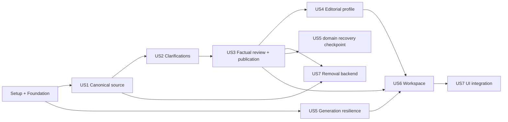

# Tasks: Canonical Document Workflow

**Input**: Design documents from `/specs/016-canonical-document-workflow/`

**Prerequisites**: `plan.md`, `spec.md`, `research.md`, `data-model.md`, `contracts/`, `quickstart.md`

**Tests**: Required by the feature specification and Constitution I. Write the listed Jest/Vitest tests first and confirm they fail before implementation. API tests must use `createPrismaMock()` and must not require PostgreSQL or `DATABASE_URL`; database migrations, SQL constraints, reset behavior, and concurrency smoke checks are validated manually through `quickstart.md` against local Docker PostgreSQL.

**Organization**: Tasks are grouped by user story. Paths are repository-relative and tasks are ordered so each checkpoint leaves validated, non-published data intact.

## Format: `[ID] [P?] [Story] Description`

- **[P]**: Can run in parallel with other ready tasks because it changes different files; it never overrides an explicit test-before-implementation dependency.
- **[Story]**: Maps the task to the corresponding user story in `spec.md`.
- Setup, foundational, and polish tasks intentionally have no story label.

---

## Phase 1: Setup (Shared Infrastructure)

**Purpose**: Prepare dependencies and deterministic fixtures without changing product behavior.

- [X] T001 Add the official `openai` SDK with pnpm and update `apps/api/package.json` and `pnpm-lock.yaml`
- [X] T002 [P] Create the multilingual duplicate/update/contradiction fixture corpus and locator fixtures in `apps/api/src/documentation/test/fixtures/canonical-corpus.ts` and `apps/api/src/documentation/test/fixtures/documents/`

---

## Phase 2: Foundational (Blocking Prerequisites)

**Purpose**: Safely reset the legacy documentary domain, create the new persistent aggregates, and provide typed durable generation infrastructure used by every story.

**⚠️ CRITICAL**: Complete the clean reset checkpoint and this entire phase before starting any user-story implementation.

### Tests and transition gate

- [X] T003 Write failing tests for exactly-once transition-state initialization, idempotent migration seeding, duplicate prevention, fail-closed behavior when the singleton is absent, read-only dry-run, inventory digest drift, `legacy → resetting → canonical` transitions, shared/exclusive mutation locking, rejection/compensation of legacy upload/Notion/delete/review writes, stopped legacy sweep advancement, idempotent R2 deletion, dependency-ordered SQL purge, resumable partial failure, zero-row/zero-failure clean gating, and preservation of non-documentary tables in `apps/api/src/documentation/reset/documentary-transition.service.spec.ts`, `apps/api/src/documentation/reset/documentary-reset.service.spec.ts`, `apps/api/src/documentation/reset/documentary-reset.command.spec.ts`, `apps/api/src/resources/resources.service.spec.ts`, and `apps/api/src/resources/resource-batch-sweep.service.spec.ts`
- [X] T004 Add singleton `DocumentaryTransitionState`, `DocumentaryResetRun`, and `DocumentaryResetItem` models, transition/reset enums, approved inventory digest, storage/database counts, and legacy-resource inventory SQL in `apps/api/prisma/schema.prisma` and `apps/api/prisma/migrations/20260811100000_add_documentary_reset_manifest/migration.sql`; the migration must idempotently seed the fixed `documentary-transition` row in mode `legacy`, enforce a SQL `CHECK` requiring that exact ID so no second logical singleton can exist, and never infer a default mode when the row is absent
- [X] T005 Implement the transition-aware dry-run/confirmed/retry runner, fail-closed shared legacy-mutation guard, digest revalidation, R2 compensation, dependency-ordered transactional SQL purge, Nest application-context CLI, and initial operator runbook in `apps/api/src/documentation/reset/documentary-transition.service.ts`, `apps/api/src/documentation/reset/documentary-reset.service.ts`, `apps/api/src/documentation/reset/documentary-reset.command.ts`, `apps/api/src/documentation/reset/documentary-reset.bootstrap.ts`, `apps/api/src/documentation/reset/documentary-reset.bootstrap.spec.ts`, `apps/api/src/documentation/reset/documentary-reset.module.ts`, `apps/api/src/documentation/reset/documentary-reset.module.spec.ts`, `apps/api/src/resources/resources.service.ts`, `apps/api/src/resources/category-reference.service.ts`, `apps/api/src/resources/resource-batch-sweep.service.ts`, `apps/api/src/resources/resources.module.ts`, `apps/api/src/app.module.ts`, `apps/api/package.json`, and `docs/documentary-workflow-runbook.md`; import/export `DocumentaryResetModule` so `ResourcesModule` can inject `DocumentaryTransitionService`, make the CLI bootstrap only a Nest application context without an HTTP listener and always close it, prove module resolution/CLI shutdown in the named smoke tests, block all legacy writes if the singleton is missing, make `resetting|canonical` block every legacy mutation/sweep, and leave transition `resetting` on any confirmed-run failure
- [X] T006 Execute the read-only dry-run and approved confirmation only against local Docker PostgreSQL plus an explicitly non-production R2 namespace, record exact rows/object keys/counts plus inventory digest in `specs/016-canonical-document-workflow/validation/reset-smoke.md`, run `pnpm --filter api typecheck`, `pnpm lint`, `pnpm test:cov`, and `pnpm build`, stop for explicit human approval before local confirmation, then confirm only if the digest is unchanged; verify exactly one transition row, R2 and SQL purge, transition `canonical`, zero legacy rows, zero pending/failed items, preserved non-documentary data, and safe retry, and do not deploy, drain, or reset Railway/production as part of `speckit-implement`
- [X] T007 Add the replacement documentary schema only after a clean reset marker by implementing all source, observation, provenance, clarification, category projection, editorial, client release, and generation models—including the renamed `DocumentationCategoryKey` enum—in `apps/api/prisma/schema.prisma` and guarded SQL in `apps/api/prisma/migrations/20260811110000_canonical_document_workflow/migration.sql`; retain the reset-empty legacy models/tables temporarily for compilation only, and prohibit new-domain reads, writes, conversion, or dual-write against them
- [X] T008 Update `createPrismaMock()` with mocks for every new Prisma delegate and transaction callback in `apps/api/src/test/prisma-mock.ts` and `apps/api/src/test/prisma-mock.spec.ts`
- [X] T009 Manually validate the guarded additive migration, transition `canonical`/clean-run preconditions, XOR provenance checks, unique pointers/sequences, cascades, preservation of non-documentary tables, emptiness and write-inaccessibility of every retained legacy documentary table, and absence of new-domain legacy reads/writes against local Docker PostgreSQL; record results in `specs/016-canonical-document-workflow/validation/migration-smoke.md`

### Shared contracts, policy, and access

- [X] T010 [P] Write failing shared-schema tests for generation routes, operations, attempts, structured blocks, safe errors, cursors, optimistic concurrency tokens, and the renamed fixed category taxonomy; add API-local parity/order tests in `packages/schemas/src/generation.test.ts`, `packages/schemas/src/documentation-common.test.ts`, `packages/schemas/src/documentation-category.test.ts`, and `apps/api/src/documentation/documentation-categories.spec.ts`
- [X] T011 Implement and export the base generation/documentation Zod schemas and `DocumentationCategoryKey` taxonomy in `packages/schemas/src/generation.ts`, `packages/schemas/src/documentation-common.ts`, `packages/schemas/src/documentation-category.ts`, `apps/api/src/documentation/documentation-categories.ts`, and `packages/schemas/src/index.ts`; keep any `ResourceCategoryKey` compatibility export isolated, deprecated, unused by new code, and scheduled for deletion in T117
- [X] T012 [P] Write failing policy tests proving independently configurable routes for `document_extraction`, `source_consolidation`, `factual_drafting`, `editorial_preview`, `client_derivation`, and `output_validation`, plus one-provider routes, ordered same/cross-provider fallback, retry bounds, transport modes, secret-free snapshots, stage isolation, and invalid/missing credentials in `apps/api/src/generation/policy/generation-policy.service.spec.ts`
- [X] T013 Implement stage-keyed `GENERATION_POLICY_JSON` parsing and startup validation for all six operation types in `apps/api/src/generation/policy/generation-policy.schema.ts` and `apps/api/src/generation/policy/generation-policy.service.ts`, then document single-provider, per-stage, and fallback samples in `apps/api/.env.example`
- [X] T014 [P] Write failing tests for contributor/client membership lookup and indistinguishable missing/unauthorized results in `apps/api/src/projects/project-access.service.spec.ts`
- [X] T015 Expose role-aware project access through `apps/api/src/projects/project-access.service.ts`, `apps/api/src/projects/projects.module.ts`, and `apps/api/src/projects/projects.service.ts` so documentation services never query another module’s membership tables directly

### Durable generation core

- [X] T016 Write failing tests for operation deduplication, policy snapshots, attempt lifecycle, leases, stale lease recovery, current-attempt guards, cancellation before submission, cancellation after remote acceptance, late-result rejection, and atomic terminal application in `apps/api/src/generation/generation.service.spec.ts` and `apps/api/src/generation/generation-worker.service.spec.ts`
- [X] T017 Define the provider-neutral request/result/usage/error interfaces and deterministic fake adapter in `apps/api/src/generation/adapters/generation-provider.ts` and `apps/api/src/generation/adapters/fake-generation.provider.ts`
- [X] T018 Implement operation creation, conditional leasing, cancellation/audit semantics, single-route submission/polling, handler registration, and guarded result application that cannot mutate domain state after cancellation or supersession in `apps/api/src/generation/generation.service.ts`, `apps/api/src/generation/generation-worker.service.ts`, and `apps/api/src/generation/generation-handler.registry.ts`
- [X] T019 Wire `GenerationModule` and the scheduled five-second worker without provider-specific domain fields in `apps/api/src/generation/generation.module.ts` and `apps/api/src/app.module.ts`
- [X] T020 Run `pnpm --filter api prisma:generate`, `pnpm --filter api typecheck`, `pnpm --filter web typecheck`, `pnpm lint`, `pnpm test:cov`, and `pnpm build`, fixing foundational failures in the files changed by T003–T019 before the foundation is consumed by a user story

**Checkpoint**: Legacy documentary originals are accounted for, the replacement schema is installed without touching accounts/projects/memberships/invitations/connections/tasks, and fake durable operations can be processed without PostgreSQL-dependent tests.

---

## Phase 3: User Story 1 — Add Knowledge to One Project Source (Priority: P1) 🎯 MVP

**Goal**: Store uploaded/Notion originals, extract attributable observations, commit complete canonical source revisions with deduplication and explicit supersession, expose provenance, guided correction, and working-language change.

**Independent Test**: Add three overlapping multilingual documents containing duplicate, updated, and unique facts; verify one current item per fact, the unambiguous update, complete provenance/history, contributor-only originals, and zero regeneration target for unaffected categories.

### Tests for User Story 1

- [X] T021 [P] [US1] Write failing shared-schema tests for source documents, source revisions/items/changes, provenance locators, language proposals, acknowledgements, and source pages in `packages/schemas/src/documentation-source.test.ts`
- [X] T022 [US1] Implement and export US1 request/response schemas in `packages/schemas/src/documentation-source.ts` and `packages/schemas/src/index.ts` after T021 fails for the expected missing behavior
- [X] T023 [P] [US1] Write failing tests for PDF/DOCX/image/Notion normalization, deterministic chunking, hashes, source locators, and extraction output accounting in `apps/api/src/documentation/source/document-input-normalizer.service.spec.ts` and `apps/api/src/documentation/source/extraction-output.schema.spec.ts`
- [X] T024 [US1] Implement provider-neutral normalization, chunking, extraction schemas, and versioned prompts in `apps/api/src/documentation/source/document-input-normalizer.service.ts`, `apps/api/src/documentation/source/extraction-output.schema.ts`, and `apps/api/src/documentation/source/prompts/extraction.prompt.ts` after T023 fails for the expected missing behavior
- [X] T025 [P] [US1] Write failing Anthropic adapter contract tests for sync/batch text, PDF, image, structured output, disabled SDK retries, correlation IDs, polling, and normalized usage in `apps/api/src/generation/adapters/anthropic-generation.provider.spec.ts`
- [X] T026 [US1] Implement the Anthropic provider adapter in `apps/api/src/generation/adapters/anthropic-generation.provider.ts` and register it in `apps/api/src/generation/generation.module.ts`
- [X] T027 [P] [US1] Write failing document service tests for 25 MB/MIME validation, R2 original preservation/compensation, immediate document+operation acknowledgement, immutable Notion snapshots, short-lived contributor URLs, list/detail states, and authorization in `apps/api/src/documentation/source/source-document.service.spec.ts` and `apps/api/src/documentation/source/document-storage.client.spec.ts`
- [X] T028 [US1] Implement R2-backed upload/Notion snapshot storage and document lifecycle services in `apps/api/src/documentation/source/document-storage.client.ts` and `apps/api/src/documentation/source/source-document.service.ts`
- [X] T029 [P] [US1] Write failing source consolidation tests for exact/semantic deduplication, extra provenance, unambiguous supersession, full snapshot copies, multilingual normalization, category impact isolation, unsupported claim rejection, stale-head requeue, and idempotent commit in `apps/api/src/documentation/source/source-revision.service.spec.ts` and `apps/api/src/documentation/source/source-consolidation.handler.spec.ts`
- [X] T030 [US1] Implement source revision reads/commits, observation dispositions, provenance validation, impacts, and optimistic requeue in `apps/api/src/documentation/source/source-revision.service.ts`, `apps/api/src/documentation/source/source-consolidation.handler.ts`, and `apps/api/src/documentation/source/prompts/consolidation.prompt.ts`
- [X] T031 [P] [US1] Write failing handler tests for extraction-to-observation persistence, current document-state guards, late results, and consolidation chaining in `apps/api/src/documentation/source/document-extraction.handler.spec.ts`
- [X] T032 [US1] Implement extraction/consolidation operation creation and result handlers in `apps/api/src/documentation/source/document-extraction.handler.ts` and `apps/api/src/documentation/documentation.module.ts`
- [X] T033 [P] [US1] Write failing controller contract tests for upload, Notion, document list/detail, canonical source, revision history, and item provenance with safe 404 responses in `apps/api/src/documentation/controllers/source-documents.controller.spec.ts` and `apps/api/src/documentation/controllers/canonical-source.controller.spec.ts`
- [X] T034 [US1] Implement source document/canonical source DTOs and controllers in `apps/api/src/documentation/dto/source-document.dto.ts`, `apps/api/src/documentation/dto/canonical-source.dto.ts`, `apps/api/src/documentation/controllers/source-documents.controller.ts`, and `apps/api/src/documentation/controllers/canonical-source.controller.ts`
- [X] T035 [P] [US1] Write failing tests for guided attributable correction and confirmed working-language change, including stale source tokens and unchanged originals/provenance identities, in `apps/api/src/documentation/source/source-correction.service.spec.ts` and `apps/api/src/documentation/source/source-language.service.spec.ts`
- [X] T036 [US1] Implement correction assertions and language proposal/confirmation flows in `apps/api/src/documentation/source/source-correction.service.ts`, `apps/api/src/documentation/source/source-language.service.ts`, and `apps/api/src/documentation/controllers/canonical-source.controller.ts`
- [X] T037 [P] [US1] Write failing frontend schema/API/hook tests for document acknowledgement, source pagination, provenance, correction, and language confirmation in `apps/web/features/documentation/api.test.ts`, `apps/web/features/documentation/schemas.test.ts`, and `apps/web/features/documentation/hooks.test.tsx`
- [X] T038 [US1] Implement documentation schemas, API calls, cache keys, upload acknowledgement merge, and source/detail hooks in `apps/web/features/documentation/schemas.ts`, `apps/web/features/documentation/api.ts`, and `apps/web/features/documentation/hooks.ts`
- [X] T039 [P] [US1] Write failing component tests for adding upload/Notion documents, reading the single source, expanding provenance/history, guided correction, original access, and language confirmation in `apps/web/features/documentation/components/add-document-dialog.test.tsx`, `apps/web/features/documentation/components/canonical-source-view.test.tsx`, and `apps/web/features/documentation/components/guided-correction-dialog.test.tsx`
- [X] T040 [US1] Implement and temporarily compose the US1 contributor components, document detail, source view, provenance, correction, and working-language copy in `apps/web/features/documentation/components/add-document-dialog.tsx`, `apps/web/features/documentation/components/canonical-source-view.tsx`, `apps/web/features/documentation/components/provenance-sheet.tsx`, `apps/web/features/documentation/components/guided-correction-dialog.tsx`, `apps/web/app/[locale]/(protected)/projects/[id]/documents/[documentId]/page.tsx`, `apps/web/app/[locale]/(protected)/projects/[id]/page.tsx`, `apps/web/messages/fr.json`, and `apps/web/messages/en.json`
- [ ] T041 [US1] Add a mocked end-to-end service test using the three-document corpus for acknowledgement → extraction → consolidation → source/provenance reads in `apps/api/src/documentation/source/canonical-ingestion.e2e-spec.ts`, then run `pnpm --filter api typecheck`, `pnpm --filter web typecheck`, `pnpm lint`, `pnpm test:cov`, and `pnpm build` as the foundation/source release gate

**Checkpoint**: US1 is independently demonstrable as one trustworthy, attributable, readable project source. No client publication behavior is required for this MVP checkpoint.

---

## Phase 4: User Story 2 — Clarify Without Silently Guessing (Priority: P1)

**Goal**: Turn every material ambiguity/contradiction into ranked, attributable source state that can be answered or deliberately left open without blocking later publication.

**Independent Test**: Incorporate a corpus with more than five material contradictions, verify every question remains reachable and ranked, answer one to create a new revision, leave one open, and verify the stable open-point identity survives the canonical-source reading model and clarification API. Factual-reference/client propagation is tested after the US3 publication gate exists.

### Tests for User Story 2

- [X] T042 [P] [US2] Write failing shared-schema tests for clarification pages, evidence, status/version tokens, batch resolutions, and open-point block IDs in `packages/schemas/src/documentation-clarification.test.ts`
- [X] T043 [US2] Implement and export clarification/evidence/resolution schemas in `packages/schemas/src/documentation-clarification.ts` and `packages/schemas/src/index.ts` after T042 fails for the expected missing behavior
- [X] T044 [P] [US2] Write failing generation tests that reject stylistic/low-value questions, preserve self-conflicts and cross-document conflicts, emit all material questions with no cap, and require complete evidence/item dispositions in `apps/api/src/documentation/source/clarification-output.schema.spec.ts` and `apps/api/src/documentation/source/prompts/clarification.prompt.spec.ts`
- [X] T045 [US2] Implement structured clarification detection, ranking, evidence mapping, and open-point revision items in `apps/api/src/documentation/source/clarification-output.schema.ts`, `apps/api/src/documentation/source/prompts/clarification.prompt.ts`, and `apps/api/src/documentation/source/source-consolidation.handler.ts`
- [X] T046 [P] [US2] Write failing service/controller tests for ordered cursor access, answer assertions/new revisions, explicit leave-open, supersession, mixed batch resolutions, and stale concurrent answers in `apps/api/src/documentation/source/clarification.service.spec.ts` and `apps/api/src/documentation/controllers/clarifications.controller.spec.ts`
- [X] T047 [US2] Implement clarification reads/resolutions and API endpoints in `apps/api/src/documentation/source/clarification.service.ts`, `apps/api/src/documentation/dto/clarification.dto.ts`, and `apps/api/src/documentation/controllers/clarifications.controller.ts`
- [X] T048 [P] [US2] Write failing frontend tests for total-aware pagination, impact ordering, evidence/provenance display, answer, and “leave as point to clarify” actions in `apps/web/features/documentation/components/clarifications-panel.test.tsx` and `apps/web/features/documentation/hooks.test.tsx`
- [X] T049 [US2] Implement clarification API/hooks/panel with optional-action semantics and localized open-point copy in `apps/web/features/documentation/api.ts`, `apps/web/features/documentation/hooks.ts`, `apps/web/features/documentation/components/clarifications-panel.tsx`, `apps/web/messages/fr.json`, and `apps/web/messages/en.json`
- [X] T050 [US2] Add a mocked corpus test with more than five material conflicts, answer/leave-open/supersede flows, and stable open-point identity across canonical-source reads and clarification API responses in `apps/api/src/documentation/source/clarification-flow.e2e-spec.ts`

**Checkpoint**: US2 can be validated against the canonical source without a hidden question cap. Full client-visible marker publication is exercised at the US3 checkpoint.

---

## Phase 5: User Story 3 — Review Factual Changes by Impacted Category (Priority: P1)

**Goal**: Generate source-revision-pinned factual drafts only for impacted categories, keep human validation independent, catch up after accept/discard, and publish accepted categories through immutable client release snapshots.

**Independent Test**: Add one document affecting two categories, accept one and leave/discard the other, then confirm only the accepted category changes client release while old content remains for the other and a newer target is never stranded.

### Tests for User Story 3

- [ ] T051 [P] [US3] Write failing shared-schema tests for category projection states, draft summaries/details, factual reviews, structured coverage blocks, client visibility, release views, and public block serialization without internal IDs in `packages/schemas/src/documentation-review.test.ts` and `packages/schemas/src/client-release.test.ts`
- [ ] T052 [US3] Implement and export factual review/client release schemas in `packages/schemas/src/documentation-review.ts`, `packages/schemas/src/client-release.ts`, and `packages/schemas/src/index.ts` after T051 fails for the expected missing behavior
- [ ] T053 [P] [US3] Write failing factual-draft generation tests for complete item/open-point coverage, fixed source revision, provenance summary, failed-output separation, and factual-vs-editorial instruction detection in `apps/api/src/documentation/review/factual-draft-output.schema.spec.ts` and `apps/api/src/documentation/review/factual-draft.handler.spec.ts`
- [ ] T054 [US3] Implement versioned factual prompts, output validation, and operation handler in `apps/api/src/documentation/review/prompts/factual-draft.prompt.ts`, `apps/api/src/documentation/review/factual-draft-output.schema.ts`, and `apps/api/src/documentation/review/factual-draft.handler.ts`
- [ ] T055 [P] [US3] Write failing projection/review tests for one active draft per category, target advancement, independent accept/correct/discard, stale tokens, immutable accepted references, and catch-up after both accept and discard in `apps/api/src/documentation/review/category-projection.service.spec.ts` and `apps/api/src/documentation/review/category-review.service.spec.ts`
- [ ] T056 [US3] Implement category projection coordination, immutable reviews/references, factual correction iterations, and catch-up scheduling in `apps/api/src/documentation/review/category-projection.service.ts` and `apps/api/src/documentation/review/category-review.service.ts`
- [ ] T057 [P] [US3] Write failing review controller contract tests including `EDITORIAL_INSTRUCTION_REQUIRED`, safe failures with no content, exact draft IDs/versions, and contributor authorization in `apps/api/src/documentation/controllers/category-review.controller.spec.ts`
- [ ] T058 [US3] Implement category draft DTOs/endpoints and editorial-intent routing in `apps/api/src/documentation/dto/category-review.dto.ts`, `apps/api/src/documentation/review/editorial-intent.service.ts`, and `apps/api/src/documentation/controllers/category-review.controller.ts`
- [ ] T059 [P] [US3] Write failing client derivation/release tests for default profile use, coverage/open-marker validation, unchanged-entry reuse, independent category pointer swap, failed derivation preservation, empty-category omission, and output serialization without internal IDs in `apps/api/src/documentation/publication/client-derivation.handler.spec.ts` and `apps/api/src/documentation/publication/client-publication.service.spec.ts`
- [ ] T060 [US3] Implement immutable client content, default editorial profile, sequenced release manifests, atomic/rebased publication, and public serialization in `apps/api/src/documentation/publication/client-derivation.handler.ts`, `apps/api/src/documentation/publication/client-publication.service.ts`, and `apps/api/src/documentation/publication/prompts/client-derivation.prompt.ts`
- [ ] T061 [P] [US3] Write failing client/contributor content controller tests proving clients resolve only `currentReleaseId` and cannot see source/provenance/drafts/pending releases/IDs in `apps/api/src/documentation/controllers/client-content.controller.spec.ts`
- [ ] T062 [US3] Atomically migrate client-content route ownership: implement contributor `GET /projects/:projectId/documentation/client-content` and existing client `GET /projects/:projectId/categories/content` in `apps/api/src/documentation/controllers/client-content.controller.ts`, make both resolve only publication release pointers, register the new controller, and unregister `CategoriesController` from `apps/api/src/resources/resources.module.ts` in the same change so no duplicate or missing route exists; do not add new dependencies on legacy category services
- [ ] T063 [P] [US3] Write failing frontend API/hook/component tests for draft cause/revision/provenance/open points, correction routing, accept/discard catch-up, published-vs-pending client preview, and public renderer isolation in `apps/web/features/documentation/components/category-review-detail.test.tsx`, `apps/web/features/documentation/components/client-content-preview.test.tsx`, and `apps/web/shared/components/client-category-view.test.tsx`
- [ ] T064 [US3] Implement factual review list/detail/dialogs, exact client preview, shared client renderer, client-tab integration, and release-aware API/hooks in `apps/web/features/documentation/components/category-review-list.tsx`, `apps/web/features/documentation/components/category-review-detail.tsx`, `apps/web/features/documentation/components/factual-correction-dialog.tsx`, `apps/web/features/documentation/components/client-content-preview.tsx`, `apps/web/shared/components/client-category-view.tsx`, `apps/web/app/[locale]/(protected)/projects/[id]/client-main-tabs.tsx`, `apps/web/features/documentation/api.ts`, and `apps/web/features/documentation/hooks.ts`
- [ ] T065 [US3] Add a mocked end-to-end test for two impacted categories, independent acceptance, open-point publication, discard catch-up, and prior-client-content preservation in `apps/api/src/documentation/review/factual-publication-flow.e2e-spec.ts`, then run `pnpm --filter api typecheck`, `pnpm --filter web typecheck`, `pnpm lint`, `pnpm test:cov`, and `pnpm build` as the P1 trust-loop release gate

**Checkpoint**: US1–US3 form the first end-to-end usable product slice: source → clarification → factual review → safe category publication.

---

## Phase 6: User Story 4 — Define and Preview the Client Voice (Priority: P2)

**Goal**: Store a modifiable project editorial profile, preview real before/after content, and atomically replace the complete published category set only after confirmation and validation.

**Independent Test**: Preview a detailed/technical → concise/pedagogical change on real content, cancel once, then confirm and force staggered category completion; verify no category switches before the complete release is ready.

### Tests for User Story 4

- [ ] T066 [P] [US4] Write failing shared-schema tests for profile values, proposals, preview states, no-content save, confirmation versions, and release progress in `packages/schemas/src/editorial-profile.test.ts`
- [ ] T067 [US4] Implement and export editorial profile/proposal/preview schemas in `packages/schemas/src/editorial-profile.ts` and `packages/schemas/src/index.ts` after T066 fails for the expected missing behavior
- [ ] T068 [P] [US4] Write failing editorial generation tests for real representative input, deterministic length limits, pedagogy/tone/familiarity constraints, factual/open-point coverage, and semantic validation in `apps/api/src/documentation/editorial/editorial-preview.handler.spec.ts` and `apps/api/src/documentation/publication/client-output-validator.service.spec.ts`
- [ ] T069 [US4] Implement editorial preview/derivation prompts, handler, deterministic coverage/length checks, and semantic validator operation in `apps/api/src/documentation/editorial/editorial-preview.handler.ts`, `apps/api/src/documentation/editorial/prompts/editorial-preview.prompt.ts`, and `apps/api/src/documentation/publication/client-output-validator.service.ts`
- [ ] T070 [P] [US4] Write failing profile/release service tests for create/replace proposal, real preview, cancel, no-content confirmation, stale versions, full-category fan-out, concurrent profile change, and 0/4→4/4 atomic publication in `apps/api/src/documentation/editorial/editorial-profile.service.spec.ts` and `apps/api/src/documentation/publication/client-publication.service.spec.ts`
- [ ] T071 [US4] Implement immutable confirmed profile revisions, proposal/preview lifecycle, full-release sequencing, and all-category atomic switch in `apps/api/src/documentation/editorial/editorial-profile.service.ts` and `apps/api/src/documentation/publication/client-publication.service.ts`
- [ ] T072 [P] [US4] Write failing editorial controller contract tests for get/propose/poll/cancel/confirm and provider-neutral safe responses in `apps/api/src/documentation/controllers/editorial-profile.controller.spec.ts`
- [ ] T073 [US4] Implement editorial DTOs and endpoints in `apps/api/src/documentation/dto/editorial-profile.dto.ts` and `apps/api/src/documentation/controllers/editorial-profile.controller.ts`
- [ ] T074 [P] [US4] Write failing frontend tests for settings controls, real before/after preview, cancel, no-content save, confirmation, and old-release progress copy in `apps/web/features/documentation/components/editorial-profile-settings.test.tsx` and `apps/web/features/documentation/hooks.test.tsx`
- [ ] T075 [US4] Implement editorial API/hooks/settings/preview confirmation UI and localized copy in `apps/web/features/documentation/api.ts`, `apps/web/features/documentation/hooks.ts`, `apps/web/features/documentation/components/editorial-profile-settings.tsx`, `apps/web/messages/fr.json`, and `apps/web/messages/en.json`
- [ ] T076 [US4] Add a mocked end-to-end profile test proving cancel safety, no fabricated preview, profile fidelity, and all-category atomic publication in `apps/api/src/documentation/editorial/editorial-release-flow.e2e-spec.ts`

**Checkpoint**: Editorial preferences are separate from factual corrections and project-wide voice changes never expose a mixed release.

---

## Phase 7: User Story 5 — Continue Safely Through AI Service Failures (Priority: P2)

**Goal**: Add bounded retry, same/cross-provider routing, operator deny gates, remote-job uncertainty handling, common validation, usage audit, and safe manual recovery while preserving prior content.

**Independent Test**: Exhaust an unavailable primary into a secondary provider with identical inputs, then disable fallback before another queued attempt; verify no forbidden send, complete attempt audit, visible `needs_attention`, and unchanged validated/published content.

### Tests for User Story 5

- [ ] T077 [P] [US5] Write failing OpenAI adapter contract tests matching the provider-neutral sync/batch/structured-output/file/usage/error interface in `apps/api/src/generation/adapters/openai-generation.provider.spec.ts`
- [ ] T078 [US5] Implement and register the OpenAI provider adapter with disabled SDK retries in `apps/api/src/generation/adapters/openai-generation.provider.ts` and `apps/api/src/generation/generation.module.ts` after T077 fails for the expected missing behavior
- [ ] T079 [P] [US5] Extend Anthropic adapter tests for 429/5xx/credit/model/invalid-request classification, 24-hour batch expiry, results-by-correlation-ID, and temporarily unavailable polling in `apps/api/src/generation/adapters/anthropic-generation.provider.spec.ts`
- [ ] T080 [US5] Implement normalized Anthropic/OpenAI failure classification and remote deadline semantics in `apps/api/src/generation/adapters/anthropic-generation.provider.ts`, `apps/api/src/generation/adapters/openai-generation.provider.ts`, and `apps/api/src/generation/generation-errors.ts`
- [ ] T081 [P] [US5] Write failing worker tests for bounded same-route retry/backoff, ordered model/provider fallback, submitted-job polling before fallback, `abandoned_unknown`, cancellation before and after provider submission, late-result rejection, all-routes exhaustion, and replacement operations in `apps/api/src/generation/generation-worker.service.spec.ts`
- [ ] T082 [US5] Implement retry scheduling, route advancement, uncertain remote-job handling, durable cancellation/audit behavior, late-result audit, terminal `needs_attention`, and replacement lineage in `apps/api/src/generation/generation-worker.service.ts` and `apps/api/src/generation/generation.service.ts`
- [ ] T083 [P] [US5] Write failing current-policy deny-gate tests for one-provider mode, disabled cross-provider fallback on old queued operations, provider removal, absent fallback secret, and already-submitted jobs in `apps/api/src/generation/policy/generation-policy-gate.service.spec.ts`
- [ ] T084 [US5] Implement the current-policy transmission gate while retaining creation snapshots in `apps/api/src/generation/policy/generation-policy-gate.service.ts` and `apps/api/src/generation/generation-worker.service.ts`
- [ ] T085 [P] [US5] Write failing provider-independent validation tests for invalid JSON, unknown/missing provenance, incomplete item/open-point coverage, wrong category/language/length, semantic failure, and refusal/token truncation in `apps/api/src/generation/generation-output-validator.service.spec.ts`
- [ ] T086 [US5] Implement common Zod/business/semantic output validation and invalid-attempt persistence in `apps/api/src/generation/generation-output-validator.service.ts` and `apps/api/src/generation/generation.service.ts`
- [ ] T087 [P] [US5] Write failing usage/audit and retry-controller tests for token/cache fields, optional pricing snapshots, secret/diagnostic stripping, safe action codes, and manual retry authorization in `apps/api/src/generation/generation-audit.service.spec.ts` and `apps/api/src/documentation/controllers/documentation-operations.controller.spec.ts`
- [ ] T088 [US5] Implement normalized attempt usage/cost audit and contributor-safe retry endpoint in `apps/api/src/generation/generation-audit.service.ts`, `apps/api/src/documentation/controllers/documentation-operations.controller.ts`, and `apps/api/src/documentation/dto/documentation-operation.dto.ts`
- [ ] T089 [P] [US5] Add regression tests proving source/reference/release pointers remain unchanged across retry, fallback, invalid output, and terminal failure in `apps/api/src/documentation/generation-failure-regression.spec.ts`
- [ ] T090 [US5] Add the complete fake-adapter recovery matrix from quickstart section 9—including cancellation and late-result safety—in `apps/api/src/generation/generation-recovery.e2e-spec.ts`, then run `pnpm --filter api typecheck`, `pnpm --filter web typecheck`, `pnpm lint`, `pnpm test:cov`, and `pnpm build` as the editorial/resilience release gate

**Checkpoint**: External service failure can delay work or require attention but cannot silently lose inputs, send to a forbidden provider, create accept-able errors, or replace validated content.

---

## Phase 8: User Story 6 — Understand the End-to-End Document State (Priority: P2)

**Goal**: Replace the disconnected resource list/review queue with one accessible contributor workspace that states what is happening, what needs action, and exactly what the client sees, updating within 15 seconds.

**Independent Test**: Keep the project open through received → processing → optional clarification → required factual review → publication preparation → published and automatic/manual failure states; verify every state/action/client visibility is discoverable without refresh on desktop and mobile.

### Tests for User Story 6

- [ ] T091 [P] [US6] Write failing shared-schema tests for workspace priority, action classes, category states, client visibility, change tokens, refresh hints, and safe localized codes in `packages/schemas/src/documentation-workspace.test.ts`
- [ ] T092 [US6] Implement and export the workspace aggregate schemas in `packages/schemas/src/documentation-workspace.ts` and `packages/schemas/src/index.ts` after T091 fails for the expected missing behavior
- [ ] T093 [P] [US6] Write failing workspace service tests for every public state/priority, active counts, release progress, retry-vs-attention actions, and absence of provider/model/diagnostic fields in `apps/api/src/documentation/workspace/documentation-workspace.service.spec.ts`
- [ ] T094 [US6] Implement the compact aggregate and safe state mapping in `apps/api/src/documentation/workspace/documentation-workspace.service.ts`
- [ ] T095 [P] [US6] Write failing controller contract tests for contributor-only workspace output and indistinguishable 404s in `apps/api/src/documentation/controllers/documentation-workspace.controller.spec.ts`
- [ ] T096 [US6] Implement the workspace endpoint and DTO mapping in `apps/api/src/documentation/controllers/documentation-workspace.controller.ts` and `apps/api/src/documentation/dto/documentation-workspace.dto.ts`
- [ ] T097 [P] [US6] Write failing TanStack Query tests for five-second active polling, stable slowdown/hidden stop, focus refetch, revision/release invalidation, mutation refetch, and stale-data retention on errors in `apps/web/features/documentation/hooks.test.tsx`
- [ ] T098 [US6] Implement aggregate polling/change-token invalidation and safe delayed-update state in `apps/web/features/documentation/hooks.ts` and `apps/web/features/documentation/api.ts`
- [ ] T099 [P] [US6] Write failing component tests for workflow status, action priority/classes, client visibility, document stages, exact current/pending preview labels, and `aria-live` change announcements in `apps/web/features/documentation/components/documentation-workspace.test.tsx`, `apps/web/features/documentation/components/workflow-status-banner.test.tsx`, and `apps/web/features/documentation/components/action-center.test.tsx`
- [ ] T100 [US6] Implement the workspace shell, status banner, action center, view navigation, source/documents/clarifications/reviews/client panels, and non-destructive refresh warning in `apps/web/features/documentation/components/documentation-workspace.tsx`, `apps/web/features/documentation/components/workflow-status-banner.tsx`, `apps/web/features/documentation/components/action-center.tsx`, and `apps/web/features/documentation/components/source-documents-panel.tsx`
- [ ] T101 [P] [US6] Write failing route/navigation tests proving contributor `/projects/[id]` renders documentation while clients retain the existing read-only surface and contributor settings/team remain reachable in `apps/web/app/[locale]/(protected)/projects/[id]/page.test.tsx` and `apps/web/shared/components/project-nav.test.tsx`
- [ ] T102 [US6] Recompose contributor/client project routing, add contributor Documentation/Team/Settings navigation, and move low-frequency controls to settings in `apps/web/app/[locale]/(protected)/projects/[id]/page.tsx`, `apps/web/app/[locale]/(protected)/projects/[id]/settings/page.tsx`, and `apps/web/shared/components/project-nav.tsx`
- [ ] T103 [P] [US6] Add responsive/accessibility tests for mobile view selector, stacked comparisons, keyboard provenance/dialog flow, focus return, icon+text status, clarification totals, and no polling skeleton replacement in `apps/web/features/documentation/components/documentation-workspace.a11y.test.tsx`
- [ ] T104 [US6] Implement responsive/accessibility states and complete French/English workflow copy in `apps/web/features/documentation/components/documentation-workspace.tsx`, `apps/web/features/documentation/components/workspace-view-selector.tsx`, `apps/web/messages/fr.json`, and `apps/web/messages/en.json`
- [ ] T105 [US6] Add a mocked frontend journey test covering the full state sequence and the 15-second polling contract in `apps/web/features/documentation/documentation-workspace.e2e.test.tsx`

**Checkpoint**: A first-time contributor can identify status, next action, and current client visibility at every stage without manual refresh.

---

## Phase 9: User Story 7 — Remove a Document Without Losing Trust (Priority: P2)

**Goal**: Preview and confirm a durable removal saga that deletes the stored original, recalculates from surviving observations/assertions, restores previously superseded truth when appropriate, and publishes only after affected-category review.

**Independent Test**: Remove one of two overlapping documents; verify shared facts/provenance survive, sole-support facts disappear, a prior supported value can re-emerge, only affected categories enter review, and old client content remains until validation.

### Tests for User Story 7

- [ ] T106 [P] [US7] Write failing shared-schema tests for removal preview, confirmation tokens, removal lifecycle/failure states, impact counts, and client visibility in `packages/schemas/src/document-removal.test.ts`
- [ ] T107 [US7] Implement and export removal request/response schemas in `packages/schemas/src/document-removal.ts` and `packages/schemas/src/index.ts` after T106 fails for the expected missing behavior
- [ ] T108 [P] [US7] Write failing removal tests for preview counts/categories, explicit confirmation, stale document/source tokens, R2 idempotence/failure, delete-during-incorporation, tombstones, surviving support, sole-support removal, superseded-value restoration, empty category, and late output rejection in `apps/api/src/documentation/source/document-removal.service.spec.ts` and `apps/api/src/documentation/source/document-removal.handler.spec.ts`
- [ ] T109 [US7] Implement removal preview, `removal_pending` storage saga, retry/attention states, surviving-observation consolidation, tombstones, and affected-category targeting in `apps/api/src/documentation/source/document-removal.service.ts` and `apps/api/src/documentation/source/document-removal.handler.ts`
- [ ] T110 [P] [US7] Extend publication tests for removal references, empty-category release omission, old-client-content preservation, and unrelated-category reuse in `apps/api/src/documentation/publication/client-publication.service.spec.ts`
- [ ] T111 [US7] Implement removal-triggered factual drafts and release omission/reuse in `apps/api/src/documentation/review/category-projection.service.ts` and `apps/api/src/documentation/publication/client-publication.service.ts`
- [ ] T112 [P] [US7] Write failing removal controller contract tests for preview/confirm/retry, contributor authorization, safe failure codes, and 202 operation state in `apps/api/src/documentation/controllers/source-documents.controller.spec.ts`
- [ ] T113 [US7] Implement removal endpoints/DTOs in `apps/api/src/documentation/controllers/source-documents.controller.ts` and `apps/api/src/documentation/dto/source-document.dto.ts`
- [ ] T114 [P] [US7] Write failing frontend tests for impact preview, explicit alert confirmation, previous-client-version explanation, removal progress/failure retry, and detail navigation in `apps/web/features/documentation/components/remove-document-dialog.test.tsx` and `apps/web/features/documentation/components/source-documents-panel.test.tsx`
- [ ] T115 [US7] Implement removal API/hooks/dialog/status UI and localized copy in `apps/web/features/documentation/api.ts`, `apps/web/features/documentation/hooks.ts`, `apps/web/features/documentation/components/remove-document-dialog.tsx`, `apps/web/features/documentation/components/source-documents-panel.tsx`, `apps/web/messages/fr.json`, and `apps/web/messages/en.json`
- [ ] T116 [US7] Add a mocked end-to-end removal test covering shared/sole/superseded facts, storage retry, affected review, empty category, and client release safety in `apps/api/src/documentation/source/document-removal.e2e-spec.ts`, then run `pnpm --filter api typecheck`, `pnpm --filter web typecheck`, `pnpm lint`, `pnpm test:cov`, and `pnpm build` as the workspace/removal release gate

**Checkpoint**: Removing a document changes only truth that no longer has valid support and never asks a model to subtract prose blindly.

---

## Phase 10: Polish & Cross-Cutting Concerns

**Purpose**: Remove the superseded implementation, prove privacy/quality/performance, and leave operational documentation ready for staged delivery.

- [ ] T117 After every replacement route/consumer is active, remove the superseded `apps/api/src/resources/` runtime/module, scheduled legacy services, legacy `apps/web/features/resources/` feature, old controllers/services/tests/registrations, `packages/schemas/src/resource-category.ts`, temporary `ResourceCategoryKey` compatibility exports, and obsolete resource/reference exports while deliberately retaining the empty legacy Prisma models/tables/enums for one deployed release; update imports to documentation-domain names and use repository-wide `rg` checks plus typecheck/build to prove there is no executable legacy documentary code, duplicate `/categories/content` route, orphan `ResourcesModule`, compatibility shim, or dead generated-content service
- [ ] T118 After a separately approved operator action has deployed T117 and supplied recorded proof that the release is healthy and every older Railway instance is drained in `specs/016-canonical-document-workflow/validation/legacy-runtime-drain.md`, remove legacy Prisma models/enums and add `apps/api/prisma/migrations/20260811120000_drop_legacy_documentary_domain/migration.sql` with SQL preconditions requiring transition `canonical`, clean reset, zero pending/failed manifest items, and zero rows in every legacy documentary table; validate the migration against local Docker PostgreSQL, manually prove each failed precondition aborts before any drop, never deploy it to production from `speckit-implement`, and document that production rollback after this schema drop permits only builds containing no legacy schema reference
- [ ] T119 [P] Update shipped product/data-model rationale and the supersession note in `docs/PRODUCT.md` to reference `specs/016-canonical-document-workflow/`
- [ ] T120 [P] Finalize the guarded reset, additive replacement migration, atomic route cutover, separate legacy-runtime removal and post-drain final drop releases, Railway deployment ordering, explicit production approval checklist, compatibility floor, and rollback procedure in `docs/documentary-workflow-runbook.md`; state that reset/drop execution is outside `speckit-implement`, rollback below the guard release is forbidden once reset starts, `resetting` is roll-forward-only, post-`canonical` rollback requires transition-aware builds, and post-T118 rollback requires builds with no legacy schema references
- [ ] T121 Add contract regression tests proving every contributor endpoint collapses unauthorized/missing responses and client payloads contain no source, provenance, internal IDs, pending state, operation, provider, model, prompt, token, or diagnostic data in `apps/api/src/documentation/documentation-security.spec.ts` and `apps/web/app/[locale]/(protected)/projects/[id]/client-main-tabs.test.tsx`
- [ ] T122 [P] Add a contract validation test that parses `specs/016-canonical-document-workflow/contracts/openapi.yaml` and checks shared DTO examples in `apps/api/src/documentation/contracts/documentation-contract.spec.ts`
- [ ] T123 [P] Add large-corpus/chunking and 100-document pure-workspace fixtures using fake adapters/Prisma mocks, require transformation p95 below 100 ms, and assert prompts contain only touched observations/impacted categories unless an explicit full-corpus reason exists in `apps/api/src/documentation/documentation-performance.spec.ts`
- [ ] T124 Run the manual operational scenarios from quickstart sections 1–7 and 9–13, without duplicating the editorial evaluation owned by T125, including the local-Docker 5-warm-up/30-read workspace/source p95-below-750-ms protocol; record reset, migration, drain/drop, corpus, fallback, polling, removal, privacy, instrumentation, environment, seed, and query-count results with no unresolved failure in `specs/016-canonical-document-workflow/validation/quickstart-results.md`
- [ ] T125 Run the real-route editorial quality protocol from quickstart section 8 over at least 20 frozen bilingual/profile-diverse cases, require deterministic fact/open-marker preservation and at least 90% all-dimension passes under two provider-blind reviewers plus third-reviewer adjudication, and record route/policy/prompt versions, binary rubric results, failures, and blocked provider state in `specs/016-canonical-document-workflow/validation/editorial-evaluation.md`; do not mark the task or SC-008 complete when the route is unavailable or the threshold is missed
- [ ] T126 Run moderated desktop/mobile usability checks for SC-006/SC-007 with at least 10 developers/freelances who have never used or previewed the workflow, standardized data/script, randomized state order, 10-second timing, and no-hint completion tracking; record results in `specs/016-canonical-document-workflow/validation/usability-results.md` and do not clear the gate unless every state check meets SC-006 and at least 9 of 10 participants meet SC-007
- [ ] T127 Run `pnpm --filter api typecheck`, `pnpm --filter web typecheck`, `pnpm lint`, `pnpm test`, `pnpm test:cov`, and `pnpm build`, then run repository-wide obsolete-code/duplicate-route/schema searches and fix only feature-related failures or residue in `apps/api/src/documentation/`, `apps/api/src/generation/`, `apps/api/src/resources/`, `apps/api/prisma/schema.prisma`, `apps/web/features/documentation/`, `apps/web/features/resources/`, `apps/web/app/[locale]/(protected)/projects/[id]/`, and `packages/schemas/src/`

---

## Dependencies & Execution Order

### Phase dependencies

- **Phase 1 — Setup**: no dependencies.
- **Phase 2 — Foundational**: depends on Setup and blocks all user stories. T003–T005 implement the guarded reset release, while T006 validates it locally only; transition `canonical` plus a clean local reset are required before T007’s additive replacement migration. Any production execution requires separate approval. T117 later removes the legacy runtime, and T118 owns the separate post-drain final legacy drop.
- **Phase 3 — US1**: depends on Foundational and is the suggested technical MVP.
- **Phase 4 — US2**: depends on US1 source revisions/observations/provenance.
- **Phase 5 — US3**: depends on US1 and US2 to deliver the complete P1 source → clarification → review → publication path.
- **Phase 6 — US4**: depends on US3 accepted references/client release infrastructure.
- **Phase 7 — US5**: can start after Foundational in parallel with US1–US4, but its final pointer-preservation/recovery checkpoint uses the US3 publication services.
- **Phase 8 — US6**: depends on US1–US5 because it aggregates and presents every workflow state.
- **Phase 9 — US7**: depends on US1 source/provenance and US3 review/publication; backend work may run in parallel with US4–US6, but final UI integration follows US6.
- **Phase 10 — Polish**: depends on all selected stories; T117 is the legacy runtime-removal release and T118 cannot begin until that release is deployed and every older instance is drained.

### User-story dependency graph



### Within each user story

1. Write the listed tests and confirm they fail for the intended reason.
2. Implement shared schemas/output contracts before services consuming them.
3. Implement domain services/handlers before controllers.
4. Implement API/frontend adapters before components.
5. Run the story’s mocked end-to-end test and checkpoint before progressing.

---

## Parallel Opportunities

### Setup and foundation

- T002 fixture creation can run alongside dependency installation T001.
- T010/T012/T014 can be authored in parallel after the replacement schema is known because they touch shared schemas, policy, and project access separately.
- T017 can proceed while T016 tests are being completed; T018 waits for both.

### User Story 1

- T021, T023, T025, T027, T029, T031, T033, T035, T037, and T039 are independent test-first tasks in separate files.
- After schemas are stable, normalization, document storage, consolidation, API contracts, and frontend tests can be implemented by separate contributors before T041 integration.

### User Story 2

- T042, T044, T046, and T048 can be authored in parallel; T050 waits for their implementations.

### User Story 3

- T051, T053, T055, T057, T059, T061, and T063 are parallel test tracks for contracts, generation, review, publication, security, and UI.

### User Story 4

- T066, T068, T070, T072, and T074 can be authored in parallel; service integration converges at T076.

### User Story 5

- T077, T079, T081, T083, T085, T087, and T089 cover independent adapter/worker/policy/validation/audit/domain tracks and can run in parallel after Foundation.

### User Story 6

- T091, T093, T095, T097, T099, T101, and T103 can be authored in parallel; T105 validates their convergence.

### User Story 7

- T106, T108, T110, T112, and T114 can be authored in parallel after the US1/US3 prerequisites; T116 validates the complete saga.

---

## Parallel Execution Examples

### US1 example

```text
Parallel: T023 normalization/extraction tests, T027 document storage tests,
T029 consolidation tests, T033 controller contracts, T037 frontend hooks,
and T039 contributor component tests.
Converge: T041 canonical ingestion flow.
```

### US2 example

```text
Parallel: T044 clarification generation rules, T046 resolution service/API,
and T048 clarification UI.
Converge: T050 uncapped clarification flow.
```

### US3 example

```text
Parallel: T053 factual output, T055 projection/review, T059 release safety,
T061 client isolation, and T063 contributor review UI.
Converge: T065 independent category publication flow.
```

### US4 example

```text
Parallel: T068 editorial generation/validation, T070 proposal/release state,
T072 API contract, and T074 settings UI.
Converge: T076 atomic editorial release flow.
```

### US5 example

```text
Parallel: T077 OpenAI adapter, T079 Anthropic errors, T081 recovery worker,
T083 deny gate, T085 common validation, and T087 usage/retry API.
Converge: T090 provider recovery matrix.
```

### US6 example

```text
Parallel: T093 aggregate mapping, T095 API contract, T097 polling,
T099 status/action UI, T101 role routing, and T103 accessibility.
Converge: T105 full live-state journey.
```

### US7 example

```text
Parallel: T108 removal saga, T110 release omission, T112 API contract,
and T114 confirmation UI.
Converge: T116 safe removal flow.
```

---

## Implementation Strategy

### MVP first

1. Complete Setup and Foundational, including the explicit clean reset checkpoint.
2. Complete US1 and validate the three-document canonical source independently.
3. Stop and demo the source/provenance/correction/language workflow before adding publication behavior.

This is the suggested technical MVP and earliest learning checkpoint. The first client-visible usable increment is Setup + Foundational + US1 + US2 + US3.

### Incremental delivery

1. **Reset implementation and local validation**: T003–T006 only; run locally until the manifest is clean, with no Railway mutation.
2. **Foundation/source release**: T007–T041; establish canonical truth and provenance.
3. **P1 trust loop**: T042–T065; clarify, review, and publish safely.
4. **Editorial/resilience release**: T066–T090; add voice control and operational fallback.
5. **Workspace/removal release**: T091–T116; replace the old UX and complete lifecycle management.
6. **Cleanup**: T117–T127 after all routes and regressions are green; T117 and T118 are mandatory separate Railway releases.

Each slice must keep `pnpm test:cov` above 80%, preserve the last validated client content, and avoid exposing provider/internal source details.

### Parallel team strategy

- One contributor owns schema/migrations/reset sequencing.
- One owns generation adapters/orchestrator.
- One owns documentary domain/API.
- One owns frontend workspace/settings.
- Shared files (`schema.prisma`, `packages/schemas/src/index.ts`, messages, app/module wiring) are merged serially to avoid false parallelism.

---

## Notes

- `[P]` means separate ready files, not “safe regardless of dependencies.”
- Never run the additive replacement migration before transition `canonical` and a clean reset; never run the final legacy drop before the T117 runtime-removal release is healthy, older instances are drained, every manifest item is terminal-success, and every legacy table is empty.
- Never put the documentary reset into the normal Railway start command.
- Never let `speckit-implement` execute a Railway/production reset, drain, deployment, or destructive schema drop; each requires a separate explicit approval and the runbook checklist.
- Once a reset reaches `resetting`, never roll back below the transition-guard release; roll forward until recovery. After `canonical`, deploy only transition-aware builds, and after T118 deploy only builds with no legacy schema references.
- Never add automated tests that require PostgreSQL or `DATABASE_URL`; use `createPrismaMock()` and the manual quickstart for database smoke validation.
- Never expose provider/model/prompt/token/diagnostic details to contributors or clients.
- Every provider output is `unknown` until Zod and business validation succeed.
- Provider/model route values remain operator configuration, not contributor settings or product copy.
- T117 removes every executable legacy documentary `Resource*` module, import, compatibility export, route registration, component, scheduled service, and test; T118 removes the empty schema shell after drain; T127 proves no code or schema residue remains.
- Stop at any checkpoint to validate the independent story before continuing.
